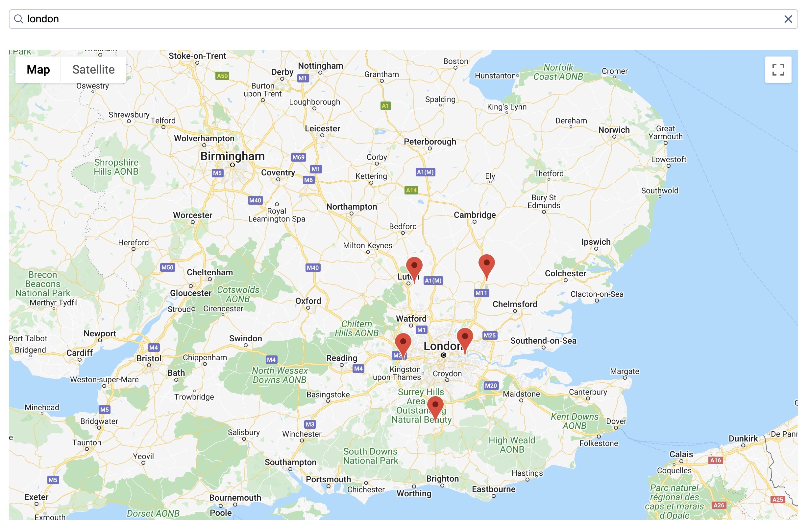

# Geo-search example with Vue InstantSearch and Google Maps

This example shows you how to add Geo search capabilities to your Vue InstantSearch implementation and displaying the found results via Google Maps.

<p align="center"></p>

## Demo

[Access the demo](https://codesandbox.io/s/github/algolia/doc-code-samples/tree/master/Vue%20InstantSearch/geo-search)

## How to run this example locally

### 1. Clone this repository

```sh
git clone git@github.com:algolia/doc-code-samples.git
```

### 2. Install the dependencies and run the server

```sh
cd Vue InstantSearch/geo-search
yarn
yarn serve
```

Alternatively, you may use npm:

```sh
cd Vue InstantSearch/geo-search
npm
npm serve
```

Open <http://localhost:8080> to see your app.

## Additional resources
Learn more [Geo Search with Vue InstantSearch](https://www.algolia.com/doc/guides/building-search-ui/ui-and-ux-patterns/geo-search/vue/) in the Algolia documentation.

